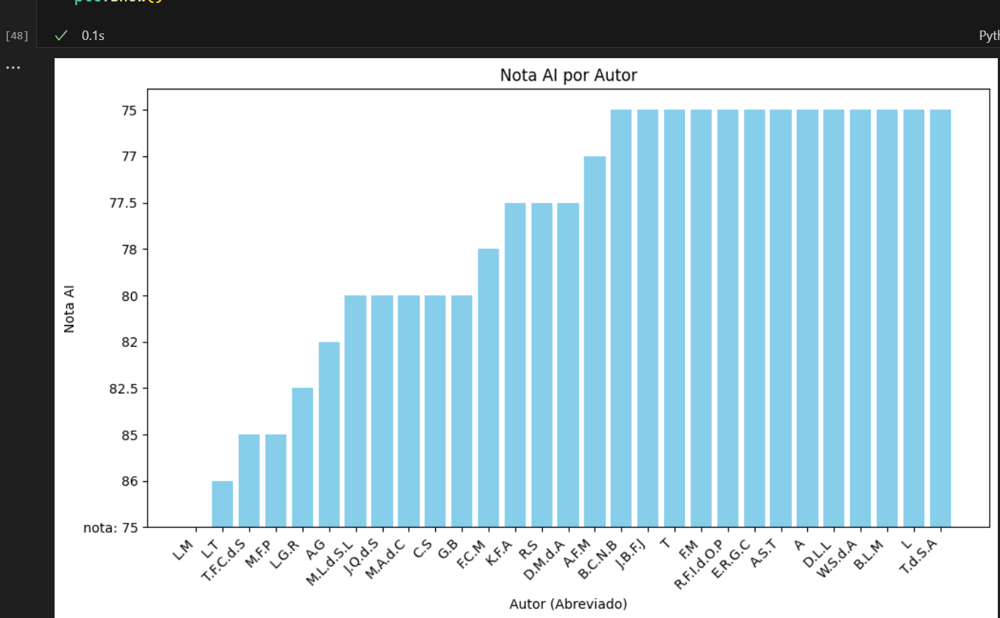

# Análise projetos discord

1. Baixa o html da página do discord [alura discord projetos](https://discord.com/channels/1228404913705451612/1228406162618060913)
2. Usa a API do gemini para avaliar cada um deles
3. Plota os 10 mais relevantes
4. Se tivesse mais tempo adicionaria mais itens relevantes ao projeto, como análise do github e dos códigos dos projetos .ipynb / python / whateaver

Selenium

```bash
$ pip install -U -q selenium webdriver-manager beautifulsoup4 pandas google-generativeai ipywidgets google-cloud-aiplatform
```

- [chrome driver](https://chromedriver.chromium.org/downloads)
- [alura discord projetos](https://discord.com/channels/1228404913705451612/1228406162618060913)
- [aistudio google](https://aistudio.google.com/app/prompts/new_chat)
- [Google AI - example](https://ai.google.dev/gemini-api/docs/quickstart?hl=pt-br)




